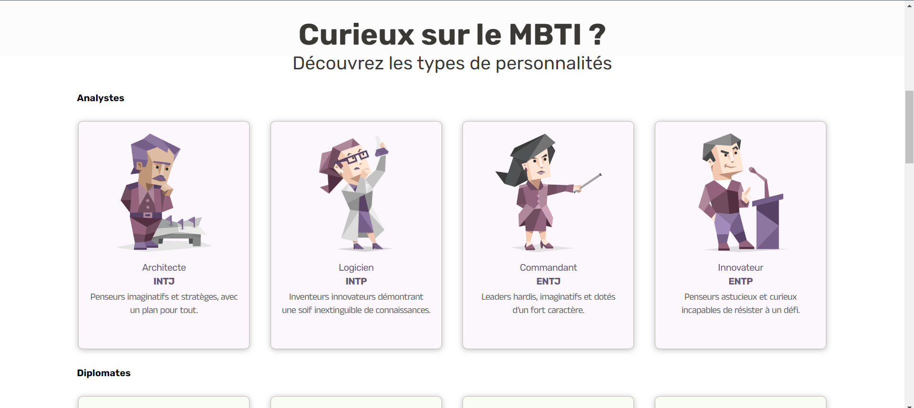
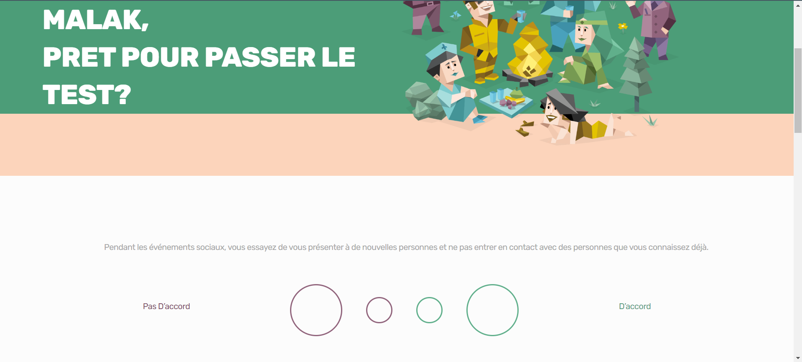
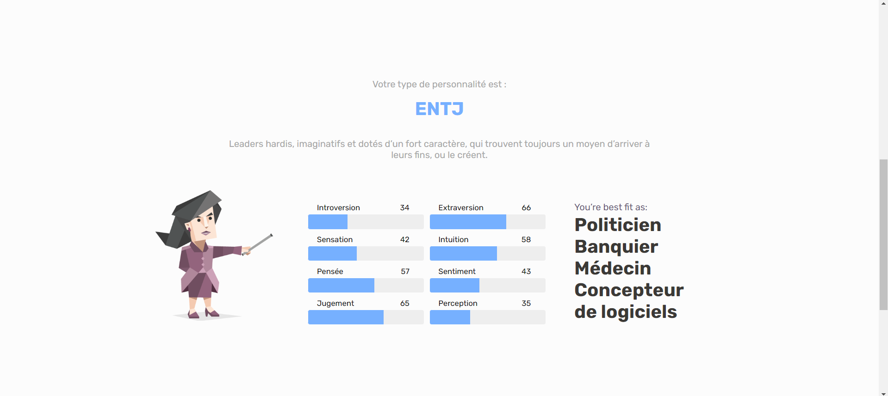

# Projet Career Map 


Notre projet porte sur le MBTI, permettant aux étudiants d'explorer différents types de MBTI, de mieux comprendre leur personnalité et de découvrir les carrières qui leur correspondent grâce à un test.

Cet article présente notre plateforme conviviale dédiée à l'exploration des types de MBTI et à la réalisation de tests de personnalité. Notre objectif est de simplifier l'accès et l'organisation des informations sur le MBTI, de créer des expériences personnalisées, et d'accroître l'engagement des étudiants et des enseignants. Cette plateforme permet aux étudiants de passer des tests de personnalité et de découvrir leurs résultats, modifiant ainsi notre approche de l'orientation professionnelle.

En utilisant la technologie pour personnaliser l'apprentissage et l'orientation, notre but n'est pas seulement de rendre l'apprentissage plus efficace, mais aussi de répondre aux exigences uniques de chaque étudiant.

## Table de matiéres

- [Aperçu](#aperçu)
- [Architecture logicielle](#architecture-logicielle)
- [Frontend](#frontend)
- [Backend](#backend)
- [Pour Commencer](#pour-commencer)
- [Dépendances](#dépendances)
- [Démonstration vidéo](#démonstration-vidéo)
- [Contribution](#contribution)


## Aperçu

Le projet vise à créer une plateforme conviviale dédiée à l'exploration des types de MBTI et à la réalisation de tests de personnalité, permettant aux étudiants de mieux comprendre leur personnalité et de découvrir les carrières qui leur correspondent. Cette plateforme priorise une planification et une organisation efficaces. Elle cherche à autonomiser à la fois les enseignants et les étudiants en tenant compte de leurs contraintes et préférences. 

Cette plateforme optimisera non seulement l'allocation des ressources, mais améliorera également l'engagement des étudiants grâce à des horaires d'apprentissage adaptables. Elle aspire à fournir aux éducateurs des outils pour saisir leurs contraintes et leurs modes d'enseignement, tout en offrant des mises à jour en temps réel et des analyses basées sur les données pour les administrateurs. 

En fin de compte, l'objectif du projet est d'améliorer les résultats d'apprentissage en rendant l'apprentissage personnalisé plus organisé, accessible et efficace.

## Architecture logicielle


L'architecture logicielle de notre projet suit une approche découplée, utilisant Spring Boot pour l'infrastructure backend et React pour le frontend, avec des communications via des API REST et Axios. 

Le backend gère les requêtes HTTP et les opérations de base de données, tandis que le frontend en React se compose de divers composants pour interagir avec les utilisateurs et envoyer des requêtes au backend. Les services de React sont alignés avec les services backend pour gérer la logique métier et les opérations de base de données.

Cette architecture assure une communication efficace, une évolutivité et une séparation des préoccupations. Elle permet une gestion et une expansion aisées des fonctionnalités de l'application, rendant l'apprentissage plus organisé, accessible et personnalisé pour répondre aux besoins uniques des étudiants.

## Frontend

### Technologies Utilisées

- React
- Tailwind CSS

## Structure du Projet Frontend

Le projet frontend en React est organisé autour de six composants principaux, chacun servant un objectif spécifique et contribuant à l'architecture globale et à la maintenabilité de l'application.

### 1. Composant BOUTON 

- Objectif : Le composant BOUTON permet d'ajouter de nouveaux éléments ou données à l'application.
- Fonctionnalité : Les utilisateurs peuvent saisir des informations pertinentes et soumettre des données, déclenchant des actions comme la création de nouveaux enregistrements ou entités.

### 2. Composant EN-TÊTE 

- Objectif : Le composant EN-TÊTE affiche et organise les éléments de navigation principaux de l'application.
- Fonctionnalité : Il fournit des liens de navigation, des images et un bouton d'accès rapide, améliorant l'expérience utilisateur et facilitant la navigation.

### 3. Composant TITRE 

- Objectif : Le composant TITRE affiche des titres et des en-têtes importants pour structurer le contenu.
- Fonctionnalité : Il présente des informations textuelles clés de manière attrayante et cohérente.

### 4. Composant IMAGE 

- Objectif : Le composant IMAGE affiche des images dans l'application.
- Fonctionnalité : Il permet de charger et de présenter des images avec des attributs personnalisables comme les classes CSS, les sources d'images, et les balises alt.

### 5. Composant CHAMP DE SAISIE 

- Objectif : Le composant CHAMP DE SAISIE permet aux utilisateurs de saisir des données dans divers formulaires ou champs de l'application.
- Fonctionnalité : Il offre des champs de texte et autres éléments interactifs pour la saisie de données, avec des styles personnalisables et des fonctionnalités comme le préfixe et le suffixe.

### 6. Composant TEXTE 

- Objectif : Le composant TEXTE affiche des contenus textuels dans l'application.
- Fonctionnalité : Il fournit des éléments de texte avec des tailles et des styles configurables pour une utilisation variée, comme des paragraphes, des instructions, ou des descriptions.

### Composants et Services Partagés

- Composants Partagés : Identifie les composants réutilisés dans plusieurs parties de l'application, favorisant la réutilisabilité du code. 
  - Exemples : Bouton, En-tête, Titre, Image, Champ de saisie, Texte.
- Services : Mentionne les services React utilisés pour des fonctionnalités communes, la récupération de données ou l'interaction avec le backend via les API REST.
  - Exemples : Services de gestion des utilisateurs, services de gestion des tests MBTI, services de récupération des résultats.

### Routage

- React Router : Décrit comment React Router est utilisé pour naviguer entre les différents composants, garantissant une expérience utilisateur fluide.
  - Utilisation des routes pour accéder aux différentes sections de l'application comme l'accueil, le tableau de bord, les tests MBTI, et les résultats.


### Style et Thème

- Style : Spécifie l'approche de stylisation, qu'il s'agisse de CSS simple, de SCSS ou de l'utilisation d'un framework CSS spécifique comme Tailwind CSS.
- Thème : Si applicable, décris comment la gestion des thèmes est effectuée dans l'application, par exemple à travers des variables CSS personnalisées ou l'utilisation de bibliothèques de thèmes spécifiques.

### Dépendances

Liste des principales dépendances pour le frontend avec leurs versions.

```json
{
  "dependencies": {
    "react": "^17.0.2",
    "axios": "^0.24.0",
    "tailwindcss": "^3.0.10",
  },
  "devDependencies": {
    "react-scripts": "5.0.0",
  }
}
```

## Backend

### Technologies Utilisées

- Spring Boot
- MySQL

## Structure du Projet Backend

Le code backend suit une structure modulaire et organisée, exploitant la puissance de Spring Boot pour construire une application robuste et évolutive.

### 1. com.example.careermap

- Classe Principale de l'Application : Application.java sert de point d'entrée pour l'application Spring Boot. Elle inclut la méthode main pour démarrer l'application.

### 2. com.example.careermap.config

- Classes de Configuration : Le package config contient des classes responsables de la gestion des requêtes HTTP entrantes. Chaque classe de contrôleur est dédiée à une fonctionnalité ou une entité spécifique, exposant des points d'extrémité RESTful. Ces classes interagissent avec les services pour traiter les requêtes et renvoyer les réponses appropriées.

### 3. com.example.careermap.controller

- Classes de Contrôleur : Le package controller contient des classes responsables de la gestion des requêtes HTTP entrantes. Chaque classe de contrôleur est dédiée à une fonctionnalité ou une entité spécifique, exposant des points d'extrémité RESTful. Ces classes interagissent avec les services pour traiter les requêtes et renvoyer les réponses appropriées.

### 4. com.example.careermap.service

- Classes de Service : Le package service héberge des classes qui encapsulent la logique métier. Ces classes sont utilisées par les contrôleurs pour effectuer des opérations sur les données et communiquer avec les dépôts. Elles fournissent une couche d'abstraction entre les contrôleurs et les dépôts.

### 5. com.example.careermap.entity

- Classes d'Entité : Le package entity comprend des classes représentant les entités de données de l'application. Ces classes sont annotées avec des annotations JPA, définissant la structure des tables de la base de données. Chaque entité correspond généralement à une table dans la base de données MySQL.

### 6. com.example.careermap.repository

- Interfaces de Repository : Le package repository contient des interfaces qui étendent les répertoires Spring Data JPA. Ces interfaces fournissent des méthodes pour les opérations CRUD de base et sont utilisées par les services pour interagir avec la base de données.

### 7. com.example.careermap.dto

- Classes DTO : Le package dto contient des classes de transfert de données (DTO) qui représentent les objets transférés entre le frontend et le backend. Ces classes fournissent une structure de données standardisée pour les échanges de données et sont utilisées par les services pour interagir avec la base de données.

### 8. com.example.careermap.payload

- Classes Payload : Le package payload contient des classes de payload qui représentent les données échangées entre le frontend et le backend lors des requêtes HTTP. Ces classes encapsulent les données à envoyer ou à recevoir et sont utilisées pour garantir la cohérence et la sécurité des échanges de données.

### Dépendances

1. Spring Boot Starter Data JPA :
   - Objectif : Simplifie l'accès aux données en utilisant JPA dans Spring Boot.

2. Spring Boot Starter Security :
   - Objectif : Fournit des fonctionnalités de sécurité pour les applications Spring Boot.

3. Spring Boot Starter Web :
   - Objectif : Fournit les dépendances nécessaires pour développer des applications web Spring Boot.

4. MySQL Connector/J :
   - Objectif : Pilote JDBC pour se connecter à une base de données MySQL.

5. Spring Boot Starter Test :
   - Objectif : Fournit les dépendances nécessaires pour les tests unitaires dans les applications Spring Boot.

6. Spring Security Test :
   - Objectif : Fournit des fonctionnalités de test pour les applications utilisant Spring Security.

```xml
    <dependency>
        <groupId>org.springframework.boot</groupId>
        <artifactId>spring-boot-starter-data-jpa</artifactId>
    </dependency>
    <dependency>
        <groupId>org.springframework.boot</groupId>
        <artifactId>spring-boot-starter-security</artifactId>
    </dependency>
    <dependency>
        <groupId>org.springframework.boot</groupId>
        <artifactId>spring-boot-starter-web</artifactId>
    </dependency>
    <dependency>
        <groupId>mysql</groupId>
        <artifactId>mysql-connector-java</artifactId>
        <version>8.0.27</version>
    </dependency>
    <dependency>
        <groupId>org.springframework.boot</groupId>
        <artifactId>spring-boot-starter-test</artifactId>
        <scope>test</scope>
    </dependency>
    <dependency>
        <groupId>org.springframework.security</groupId>
        <artifactId>spring-security-test</artifactId>
        <scope>test</scope>
    </dependency>
```

## Pour Commencer

Bien sûr ! Voici des instructions étape par étape pour configurer et exécuter votre projet localement :

### Prérequis :

1. Git :
   - Assurez-vous d'avoir Git installé. Sinon, téléchargez-le et installez-le depuis [git-scm.com](https://git-scm.com/).

### Configuration du Backend :

1. Cloner le Projet :
   bash
   git clone <repository_url>
   cd <project_folder>
   

2. Installer les Dépendances Backend :
   - Ouvrez un terminal dans le dossier du projet backend.
   - Exécutez les commandes suivantes :
     bash
     mvn clean install
     

3. Exécuter le Backend :
   - Démarrez vos serveurs MySQL.
   - Lancez l'application Spring Boot. La base de données et les entités seront créées automatiquement.
   - Vérifiez que le backend fonctionne en visitant [http://localhost:8080](http://localhost:8080) dans votre navigateur.

### Configuration du Frontend :

1. Installer les Dépendances Frontend :
   - Exécutez les commandes suivantes dans le dossier du projet frontend :
     bash
     npm install
     

   - Si vous rencontrez des erreurs pendant l'installation, utilisez la commande suivante :
     bash
     npm install --save --legacy-peer-deps
     

2. Exécuter le Frontend :
   - Après avoir installé les dépendances, démarrez le serveur de développement React :
     bash
     npm start
     

   - Accédez au frontend à l'adresse [http://localhost:3000](http://localhost:3000) dans votre navigateur.

Maintenant, votre projet full-stack devrait être configuré et fonctionner localement. Si vous rencontrez des problèmes lors de la configuration, vérifiez les logs de la console pour les messages d'erreur et assurez-vous que toutes les dépendances et prérequis sont correctement installés.

# Exemple Illustratif
Nous visons à présenter une solution basée sur les préférences et les caractéristiques des différents types de personnalité MBTI. Chaque individu ayant un type de personnalité spécifique, notre projet vise à fournir des informations sur les préférences en matière de carrière et d'apprentissage correspondant à chaque type MBTI.


Figure 3 : Page de personnalités


Figure 4 : Page de test


Figure 5 : Page de resultat

# Démonstration vidéo

Cliquez sur le lien ci-dessous pour regarder une vidéo de démonstration :


# Contribution

Nous accueillons les contributions de tous et nous apprécions votre aide pour améliorer encore ce projet ! 
Si vous souhaitez contribuer, veuillez suivre ces directives :

## Contributeurs
- Oumaima Dagoun ([GitHub](https://github.com/oumaimadgn))
- Ali Ghannam ([GitHub](https://github.com/reyji24))
- Aya Nor Elyakine ([GitHub](https://github.com/norelyakine))
- Leila Mekiani ([GitHub](https://github.com/Leilaemsi))
- Amal Ourajim ([GitHub](https://github.com/AmalOur))
- Mohamed Lachgar ([Researchgate](https://www.researchgate.net/profile/Mohamed-Lachgar))
